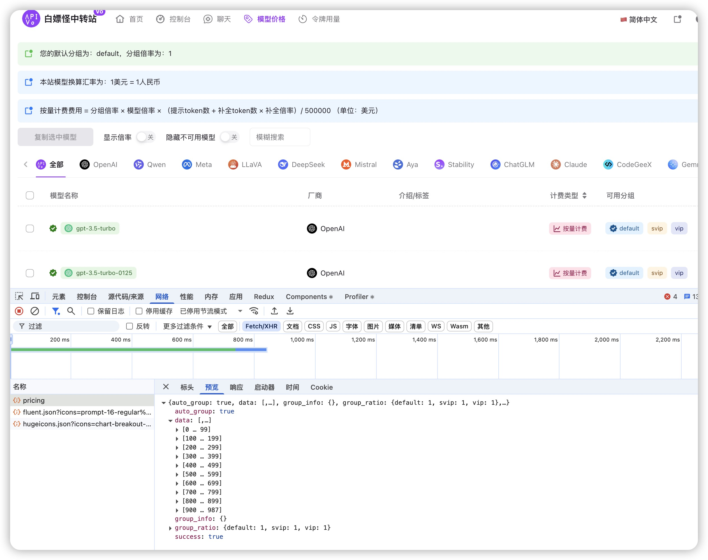

# NewBotAI 自动注册与签到脚本

这是一个用于 NewBotAI 平台的自动注册和签到脚本集合，支持账号批量注册、多账户管理和自动签到功能。

> NewBotAI 是一个可以白嫖多种Ai模型的平台，可以免费试用多种AI模型，目前可以白嫖988种模型。注册就送50刀，每日签到送50刀。




## 功能特点

- 支持账号批量自动注册
- 支持多账户配置和管理
- 模拟人工操作，降低被检测风险
- 自动记录签到结果和账户余额
- 支持自定义浏览器配置
- 详细的日志记录
- 命令行统一管理工具

## 安装依赖

```bash
pip install -r requirements.txt
```

### 依赖项说明

- **DrissionPage**: 用于浏览器自动化
- **PyYAML**: 用于处理YAML配置文件
- **python-dateutil**: 用于日期时间处理
- **playwright**: 用于register.py脚本中的自动化操作
- **selenium**: 用于sign.py脚本中的自动化操作
- **webdriver-manager**: 用于自动管理WebDriver

## 配置说明

1. 复制并修改配置文件

```bash
cp config.yaml.example config.yaml
```

2. 编辑 `config.yaml` 文件，添加你的账户信息：

```yaml
accounts:
  - username: "your_email1"
    password: "your_password1"
  - username: "your_email2"
    password: "your_password2"
```

3. 配置文件说明：
   - 配置文件使用追加模式，不会覆盖已有账号
   - 成功注册的新账号会自动追加到配置文件
   - 如果配置文件不存在，则会自动创建

## 使用方法

### 命令行工具

使用 `main.py` 统一命令行工具:

```bash
# 显示帮助信息
python main.py

# 注册账号
python main.py register --num-accounts 100 --show-browser

# 执行签到
python main.py sign
```

### 账号注册

使用 `register.py` 脚本批量注册账号：

```bash
# 默认无头模式注册1000个账号
python register.py

# 显示浏览器窗口
python register.py --show-browser

# 指定注册数量
python register.py --num-accounts 500
```

注册的账号会自动保存到：

- `accounts.txt`：保存所有生成的账号名
- `config.yaml`：添加成功注册的账号及密码

### 账号签到

使用 `sign.py` 脚本执行自动签到：

```bash
python sign.py
```

## 日志说明

- 日志文件保存在 `logs` 目录下
- 按日期生成独立的markdown格式日志文件
- 记录每个账号的签到状态和余额信息
- 可查看详细的操作日志和错误信息

## 脚本文件说明

- `main.py`: 统一命令行工具，整合所有功能
- `register.py`: 批量注册账号
- `sign.py`: 自动签到
- `config.yaml`: 配置文件
- `accounts.txt`: 生成的账号列表
- `requirements.txt`: 依赖项列表

## 参数设置

### main.py 参数

```
register             批量注册账号
  --show-browser     显示浏览器窗口（默认为无头模式）
  --num-accounts N   要注册的账号数量（默认1000个）

sign                 执行自动签到
```

### register.py 参数

```
--show-browser    显示浏览器窗口（默认为无头模式）
--num-accounts    要注册的账号数量（默认1000个）
```

## 注意事项

1. 请确保配置文件中的账户信息正确
2. 建议不要将配置文件提交到代码仓库（已加入.gitignore）
3. 可以根据需要调整浏览器配置参数
4. 如遇到问题，请查看日志文件了解详细信息
5. 批量注册时建议使用无头模式，速度更快
6. 签到脚本会自动记录每日签到结果
7. 优先使用main.py命令行工具，它提供了统一的接口
